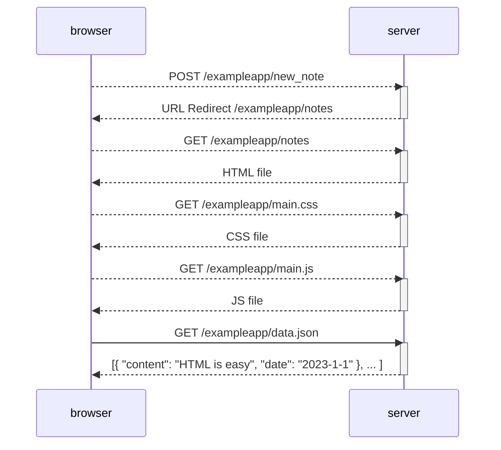

```mermaid
sequenceDiagram
  participant browser
  participant server

  browser -->> server: POST /exampleapp/new_note
  activate server
  server -->> browser: URL Redirect /exampleapp/notes
  deactivate server

  browser -->> server: GET /exampleapp/notes
  activate server
  server -->> browser: HTML file
  deactivate server

  browser -->> server: GET /exampleapp/main.css
  activate server
  server -->> browser: CSS file
  deactivate server

  browser -->> server: GET /exampleapp/main.js
  activate server
  server -->> browser: JS file
  deactivate server

  browser->>server: GET /exampleapp/data.json
    activate server
    server-->>browser: [{ "content": "HTML is easy", "date": "2023-1-1" }, ... ]
    deactivate server
```
