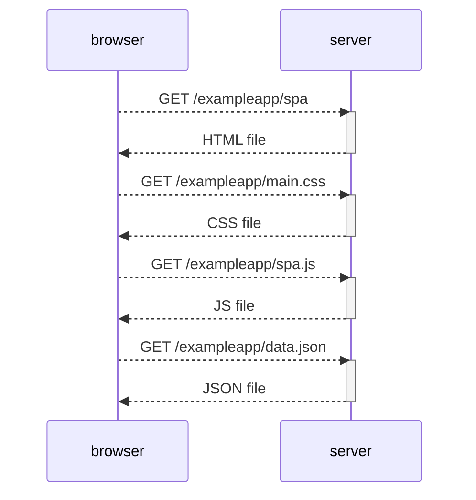

```mermaid
sequenceDiagram
  participant browser
  participant server

  browser -->> server: GET /exampleapp/spa
  activate server
  server -->> browser: HTML file
  deactivate server

  browser -->> server: GET /exampleapp/main.css
  activate server
  server -->> browser: CSS file
  deactivate server

  browser -->> server: GET /exampleapp/spa.js
  activate server
  server -->> browser: JS file
  deactivate server

  browser -->> server: GET /exampleapp/data.json
  activate server
  server -->> browser: JSON file
  deactivate server


```
